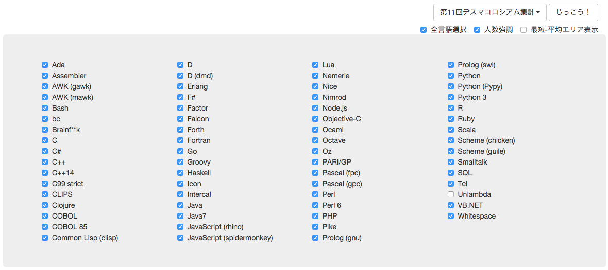

# です☆ころちゃーと

*Deathma Colosseum Time Series Chart*

#### Example 1: 11th chart

#### Example 2: 11th chart with min-avg area

#### Display Options

## Installation
Clone this repository, then

`bundle install`

## Usage
Just run the ruby code

`ruby app.rb`

That's all.

* To see the chart, just access to [http://localhost:4567](http://localhost:4567)
* To get original JSON data, access to [http://localhost:4567/stats/11](http://localhost:4567/stats/11)
  * `/stats/n` where 2 ≦ n (≦ 11)

#### Change language color
* Change or add to `langColors` array in `/views/script.coffee`
* Currently some language colors are pre-defined as my feeling, and the others are colored by *highcharts*'s default color if any.

## Acknowledgements

This tool is inspired by すっぴーさん(@suppy193)'s tweet with nice visualization!

<blockquote class="twitter-tweet" lang="ja">
<a href="https://twitter.com/hashtag/%E3%83%87%E3%82%B9%E3%83%9E%E3%82%B3%E3%83%AD%E3%82%B7%E3%82%A2%E3%83%A0?src=hash">#デスマコロシアム</a> 某言語の動きがアツイので最短文字数の推移をグラフにしてみました。ポイントは&#10;・Brainf**kはどこまで短くなるのか。&#10;・tbpgrさんの集計時刻！！&#10;※Unlambdaはグラフに含めていません。ご了承ください。 <a href="http://t.co/gY6B2OHqfQ">pic.twitter.com/gY6B2OHqfQ</a>
&mdash; suppy（すっぴー） (@suppy193) <a href="https://twitter.com/suppy193/status/618598611203563520">2015, 7月 8</a></blockquote>

Also thanks to てぃーびーさん(@tgpgr) a.k.a デスマコロシアム管理人
